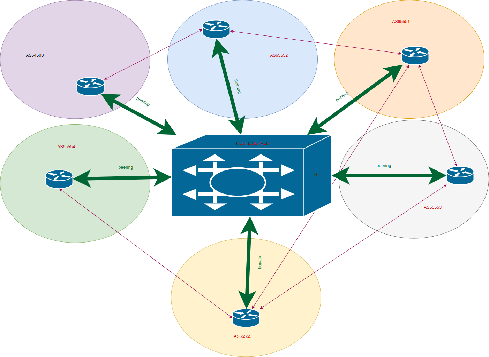

BGP (Border Gateway Protocol)
=====

Premessa
-----

In questo spazio, nato da un'idea di `ITNOG <https://www.itnog.it/>`__ (*the ITalian Network Operators Group*), intendiamo fornire una breve guida in lingua italiana ai principali concetti e meccanismi sottesi al funzionamento di Internet illustrando alcune delle architetture di instradamento basate sul protocollo *BGP - Border Gateway Protocol*.
L'obiettivo dunque non è quello di tradurre e parafrasare le RFC (*Request for comments*) [#]_, né quello di somministrare un ricettario; piuttosto vorremmo divulgare (con linguaggio semplice) i capisaldi della letteratura conditi con esempi intuitivi così da facilitare la strada a quanti vorranno poi approfondire.

La struttura del testo si rifà a un approccio sempreverde (cioè di tipo *bottom-up*, dal basso verso l’alto), scandito secondo questi punti:

- `protocolli di instradamento: fondamenti e concetti`_;
- `distance vector vs link-state`_;
- `instradamento interno o esterno, statico o dinamico`_;
- `come funziona BGP`_;
- `sessioni BGP`_;
- `processo di instradamento`_;
- `controllo degli instradamenti`_;
- `filtri e manipolazioni`_;
- `ridondanza e bilanciamento`_;
- `sicurezza`_.

Per quanto possibile saranno indicate le fonti, le migliori pratiche e le recenti tecnologie così come pubblicate da `RFC Editor <https://rfc-editor.org>`__ [#]_ e dalle altre organizzazioni coinvolte nella definizione degli standard.

Protocolli di instradamento: fondamenti e concetti
-----

L'attore protagonista in tutte le attività di instradamento si chiama *router*: quell'apparato capace di instradare il traffico dei dispositivi secondo delle tabelle contenenti indispensabili informazioni sui migliori percorsi (*best path*) verso tutte le destinazioni che conosce.

Per consentire l'instradamento, il *router* segue una procedura che si articola in diversi punti:

1. scelta di un cosiddetto protocollo di instradamento (*routing protocol*) utile a scambiare con altri *router* della rete informazioni sui percorsi e sulle destinazioni;

2. inserimento di tali informazioni in tabelle di instradamento (*routing table*), una per ciascun protocollo;

3. analisi di tutte le tabelle popolate e scelta dei migliori percorsi (*best path*) verso ciascuna destinazione;

4. associazione di ciascuna destinazione con l'indirizzo del dispositivo collegato (*next-hop*) all'interfaccia di uscita dei pacchetti verso quella destinazione;

5. popolamento di una tabella di inoltro (*forwarding table*) con queste ultime informazioni;

6. individuazione dell'indirizzo di destinazione di un pacchetto ricevuto attraverso la lettura dell'intestazione di quel pacchetto;

7. consultazione della tabella di inoltro per ottenere informazioni sull'interfaccia di uscita e l'indirizzo del dispositivo utile al raggiungimento della destinazione;

8. compimento di eventuali altre azioni prima di inoltrare il pacchetto al successivo dispositivo;

9. ripetizione della procedura fin quando la destinazione viene raggiunta secondo lo schema di un salto dopo l'altro (*hop-by-hop*), tipico delle reti a commutazione di pacchetto.

Alla base dei protocolli di instradamento più implementati ci sono generalmente tre algoritmi: vettore di distanze (*distance vector*), stato di collegamento (*link-state*) e vettore di percorsi (*path vector*).

Torna all'inizio di `BGP (Border Gateway Protocol)`_

*Distance vector vs link-state*
-----

Come calcolare la distanza più breve per raggiungere una destinazione? Questo è il campo dove si gioca la partita dei protocolli di instradamento sulla rete.

Quello basato sul vettore di distanze prevede una lista (il vettore appunto) di distanze associate al prefisso di ogni destinazione appreso dai messaggi provenienti da altri *router* sulla rete. Cioè praticamente ciascun *router* calcola autonomamente il percorso migliore verso ogni destinazione e, sùbito dopo, invia il proprio vettore di distanze agli altri *router* in rete.

Così facendo, tutti i *router* coinvolti nel processo contribuiscono a influenzare le proprie tabelle di instradamento fino a convergere su una lista di *best path* condivisa.

Proprio l'aspetto della convergenza è stato riconosciuto nel tempo come momento critico per un protocollo. Cioè, quanto tempo occorre affinché l'intera rete (o meglio i *router* che la costituiscono) sia al corrente della comparsa, scomparsa o cambiamento di un particolare instradamento?

Le argomentazioni necessarie a dare una risposta a quella domanda costituiscono una base critica all'adozione su larga scala di protocolli *distance vector*: dunque lentezza nella convergenza e difficoltà di gestire un gran numero di destinazioni.

Alcuni esempi di protocolli di instradamento basati sull'algoritmo del *distance vector* sono: *RIP - Routing Information Protocol* `[RFC2453] <https://www.rfc-editor.org/rfc/rfc2453.txt>`__, *EIGRP - Enhanced Interior Gateway Routing Protocol*  `[RFC7868] <https://www.rfc-editor.org/rfc/rfc7868.txt>`__.

Torna all'inizio di `BGP (Border Gateway Protocol)`_

_____

Diverso protocollo di instradamento, e più complesso del precedente, è quello basato sull'algoritmo *link-state* [#]_. In questo caso i *router* si scambiano informazioni proprio sullo stato del collegamento e quindi non tabelle di instradamento.

L'oggetto delle comunicazioni tra apparati che ne fanno uso risiede nelle informazioni su *router* e reti adiacenti incluse delle grandezze (*metric*) associate alla connessione. In altre parole ciascun *router* produce un messaggio che contiene una descrizione del dispositivo stesso e di dove si connette agli altri; messaggio che viene distribuito a tutti gli altri *router* della rete i quali lo archiviano in una base di dati interna. Così ciascun dispositivo sarà in grado di ricostruire autonomamente una topologia della rete che sarà uguale per tutti.

Dopodiché, tutti i *router* saranno in grado di calcolare e tratteggiare un albero (dove ciascun dispositivo pone sé stesso alla radice) di cosiddetti *best path* verso ciascuna destinazione applicando l'algoritmo `SPF - Shortest Path First <http://www-m3.ma.tum.de/foswiki/pub/MN0506/WebHome/dijkstra.pdf>`_ concepito nel 1959 dal matematico olandese Edsger W. Dijkstra [#]_.

Queste caratteristiche rendono il *link-state* un algoritmo più adatto a essere impiegato in scenari grandi e complessi, tuttavia sempre interni a un sistema autonomo. Infatti su grandi reti, come Internet, l'instabilità di alcuni collegamenti renderebbe le ritrasmissioni e i conseguenti calcoli un lavoro troppo oneroso (e di conseguenza inefficiente) per i singoli *router*.

I due più importanti esempi di protocolli di instradamento basati sull'algoritmo *link-state* sono *OSPF - Open Shortest Path First* (versione 2 `[RFC2328] <http://www.rfc-editor.org/rfc/rfc2328.txt>`__ e versione 3 `[RFC5340] <https://www.rfc-editor.org/rfc/rfc5340.txt>`__ che supporta IPv6) e *IS-IS - Intermediate System to Intermediate System* `[ISO/IEC 10589:2002] <http://standards.iso.org/ittf/PubliclyAvailableStandards/c030932_ISO_IEC_10589_2002(E).zip>`__.

Torna all'inizio di `BGP (Border Gateway Protocol)`_

Instradamento interno o esterno, statico o dinamico
--------

Abbiamo visto come diversi siano i metodi per rendere le risorse di rete raggiungibili, ma occorre aggiungere ancóra un tassello determinante per la prosecuzione dell'illustrazione, e cioè il loro àmbito (o dominio) di applicazione. Per questo è necessario introdurre la nozione di sistema autonomo, fin qui solo velocemente menzionata.

Si tratta della cellula più piccola che dà vita all'organismo di Internet e dobbiamo immaginarla come la tessera di un mosaico la quale può trovarsi nel centro o ai bordi del quadro ma sempre con almeno un lato (preferibilmente almeno due, come spiegato in coda al paragrafo `Sessioni BGP`_) connesso ad altre tessere.

Da un punto di vista tecnico una definizione può essere rintracciata nella `[RFC1930] Guidelines for creation, selection, and registration of an Autonomous System (AS) <http://www.rfc-editor.org/rfc/rfc1930.txt>`_ dove si legge:

   *"Un sistema autonomo è un gruppo di uno o più prefissi IP gestito da uno o più operatori di rete con una politica di instradamento UNICA e BEN DEFINITA."* [t.d.r.]
   [CIT-RFC1930]_

Fino al 2007 la rappresentazione di un *AS* avveniva per mezzo di un numero a 16 bit (a esempio 64500), dopodiché per mezzo di un numero a 32 bit (a esempio in formato *asplain* 65551 o, in formato *asdot+*, 1.15), come regolata dalla `[RFC5396] Textual Representation of Autonomous System (AS) Numbers <https://www.rfc-editor.org/rfc/rfc5396.txt>`_.

Più dettagliatamente possiamo considerare un "dentro" e un "fuori" dal punto di vista di un *AS* e cioè rispettivamente instradamenti *intra-AS* e instradamenti *inter-AS*.

    *Figura 1: Instradamenti intra-AS e inter-AS.*

Ora, gli instradamenti possono essere classificati anche per la modalità con la quale vengono appresi dai *router*: quando inseriamo manualmente un percorso verso una destinazione, allora si chiamerà "instradamento statico" (*static routing*); quando invece i dispositivi apprendono gli instradamenti grazie a un protocollo, allora si parlerà di "instradamento dinamico" (*dynamic routing*).

All'interno di questa ultima categoria distinguiamo: per il cosiddetto instradamento interno al sistema autonomo, *IGP - Interior Gateway Protocol* (come *RIP, EIGRP, OSPF, IS-IS*); per l'instradamento esterno tra sistemi autonomi diversi, *EGP - Exterior Gateway Protocol* (come *BGP*).

Torna all'inizio di `BGP (Border Gateway Protocol)`_

Come funziona BGP
-----

Nato nel 1989, quando *IETF* (*Internet Engineering Task Force*) partorì la `[RFC1105] A Border Gateway Protocol (BGP) <https://www.rfc-editor.org/rfc/rfc1105.txt>`__ recante la versione 1 del protocollo, BGP subì nel tempo alcuni profondi cambiamenti e, nel 1995, RFC Editor pubblicò le specifiche della versione 4, oggi raccolte nella `[RFC4271] A Border Gateway Protocol 4 (BGP-4) <https://www.rfc-editor.org/rfc/rfc4271.txt>`__.

Il BGP si basa su un algoritmo di instradamento chiamato "vettore di percorsi" (*path vector*), cioè i messaggi che produce contengono una lista di percorsi dati dai sistemi autonomi che occorre attraversare per raggiungere una certa destinazione (identificata da un prefisso di rete).

**Esempio di AS path:**

============== ============  ==========================
     Rete         Vicino              Percorso
============== ============  ==========================
203.0.113.0/24 198.51.100.1  64496_65551_64511_65536
============== ============  ==========================

Questo esempio può essere così letto:

è possibile raggiungere la rete 203.0.113.0/24 (*network*) attraverso il dispositivo 198.51.100.1 (*next hop*) il quale propone un percorso (*path*) che consiste nel transitare, oltre che per sé stesso ovviamente, per gli *AS* 64496, 65551, 64511, così da approdare infine all'*AS* 65536 dove la risorsa di destinazione risiede.

Il dispositivo chiamato "vicino" (*neighbor*) è un *router* capace di parlare la lingua del BGP (*BGP speaking*) che viene trasportata dal protocollo *TCP* (*Transport Control Protocol*) sulla porta 179, registrata proprio per questo scopo presso `IANA - Internet Assigned Numbers Authority <https://www.iana.org/assignments/service-names-port-numbers/service-names-port-numbers.txt>`__.

L'intestazione del messaggio BGP che viene scambiato tra due *router* ha il seguente aspetto::

      0                   1                   2                   3
      0 1 2 3 4 5 6 7 8 9 0 1 2 3 4 5 6 7 8 9 0 1 2 3 4 5 6 7 8 9 0 1
      +-+-+-+-+-+-+-+-+-+-+-+-+-+-+-+-+-+-+-+-+-+-+-+-+-+-+-+-+-+-+-+-+
      |                                                               |
      +                                                               +
      |                                                               |
      +                                                               +
      |                           Marker                              |
      +                                                               +
      |                                                               |
      +-+-+-+-+-+-+-+-+-+-+-+-+-+-+-+-+-+-+-+-+-+-+-+-+-+-+-+-+-+-+-+-+
      |          Length               |      Type     |
      +-+-+-+-+-+-+-+-+-+-+-+-+-+-+-+-+-+-+-+-+-+-+-+-+

A seconda del tipo di messaggio, dopo l'intestazione potrebbero seguire dei dati.

A ogni modo il campo *marker*, oggi presente ma non più usato, ha una consistenza fissa di 16 byte e aveva la funzione di far determinare se il messaggio BGP contenesse informazioni di autenticazione oppure no.

Il campo denominato *length* serve a dichiarare la lunghezza dell'intero messaggio BGP, intestazione compresa; per questo è semplice calcolarne il valore minimo: 19 byte (cioè 16 il *marker*, 2 il *length*, 1 il *type*). Il valore massimo, per RFC, è di 4096 byte.

Il campo *type* definisce invece il tipo di messaggio trasmesso e può recare dei codici che possono indicare i seguenti valori:

- *OPEN*;
- *UPDATE*;
- *NOTIFICATION*;
- *KEEPALIVE*;
- *ROUTE REFRESH*.

Per una migliore comprensione dell'intero processo di instradamento gestito dal protocollo BGP, è utile a questo punto esaminare e comprendere la funzione degli ingranaggi in movimento sotto il cofano.

Partiamo dal messaggio *OPEN* che costituisce il primo passo affinché due *router* possano stabilire una connessione secondo il protocollo BGP.

Gli elementi del messaggio *OPEN* sono:

- **[version]** la versione del protocollo (oggi si usa sempre la versione 4);
- **[my autonomous system]** il numero di sistema autonomo al quale il *router* appartiene;
- **[hold timer]** il numero di secondi che può trascorre tra i successivi messaggi di *UPDATE* o *KEEPALIVE*;
- **[bgp identifier]** l'identificativo del *bgp speaking router* (spesso il più alto indirizzo IP assegnato al dispositivo);
- **[optional parameter length]** la lunghezza in byte del seguente parametro opzionale;
- **[optional parameters]** una lista di parametri opzionali come a esempio quelli per l'autenticazione.

Affinché la connessione BGP tra due *router* venga stabilita correttamente è necessario che l'iter superi alcuni passaggi.

Innanzitutto partiamo dallo stato di riposo (**idle**) nel quale si trova un *router* prima di ricevere il via alla connessione che possiamo dare noi stessi intervenendo sulla configurazione del dispositivo. Ricevuto il via (*start*), il primo *router* tenta una connessione TCP sulla porta 179 del secondo e poi si mette in ascolto di risposte provenienti dal secondo *router*.

Ecco che entriamo nel passaggio di connessione (**connect**) durante il quale si attende che la connessione TCP avvenga con successo. In quest'ultimo caso si procede verso un ulteriore passaggio chiamato *opensent*. Se invece la connessione TCP non viene stabilita, allora si va verso il passaggio *active*. E ancóra, nel caso in cui si esaurisca il tempo per l'operazione, si azzera il *timer* e viene ritentata una connessione TCP, mentre lo stato rimane *connect*. Altri eventi innescati dal sistema o manualmente da noi, producono il ritorno allo stato di riposo.

Segue lo stato attivo (**active**) che semplicemente indica un momento di transizione o verso il successo della connessione TCP o verso il suo fallimento con successivo innesco di un ulteriore tentativo.

Se la connessione TCP va a buon fine, allora siamo nel passaggio **opensent** dove scende in campo il protocollo BGP che si mette in attesa di un messaggio di tipo *OPEN* da parte del secondo *router*. Se arriva, il messaggio viene controllato e in caso di errore il *router* risponde con un messaggio di notifica (*NOTIFICATION*), dopodiché torna in stato di riposo.

Ma se il messaggio *OPEN* è corretto, allora il motore del BGP si mette in moto e il primo *router* comincia a inviare al secondo messaggi di tipo *KEEPALIVE* per mantenere viva la connessione.

Siamo ancóra nel passaggio *opensent* quando il *router* confronta il campo *my autonomous system* inviatogli dal secondo *router* con il proprio numero di *AS* così da capire se entrambi appartengano o no allo stesso sistema autonomo. Nel primo caso saremmo nel contesto di BGP interno (*internal BGP*), nell'altro invece ci troveremmo nel contesto di BGP esterno (*external BGP*), una notizia importantissima che influenza molti comportamenti del protocollo.

A questo punto ci troviamo in un passaggio denominato **openconfirm** che conduce verso due distinte situazioni: il primo *router* attende un messaggio *KEEPALIVE* dal secondo; se arriva, la negoziazione si completa e dunque la connessione si considera stabilita (*established*). Altrimenti se il primo *router* riceve un messaggio di *NOTIFICATION*, si torna allo stato di riposo.

Infine, se è andato tutto a buon fine ci si ritrova all'ultimo passaggio, **established**, dove i *router* cominciano a scambiarsi messaggi di tipo *UPDATE* che devono essere privi di errori, poiché, se rinvenuti, viene generato un messaggio di *NOTIFICATION* e inevitabilmente si va dritti allo stato di riposo.

Qualora la connessione TCP dovesse interrompersi, il *router* tornerebbe allo stato *active*.

Nominato più volte, ispezioniamo il contenuto del messaggio *NOTIFICATION* precisando che viene generato in caso di errore e
infatti contiene: un codice di errore, un altro codice subordinato al primo e un campo di dati a lunghezza variabile.

Il messaggio *KEEPALIVE* ha invece una diversa funzione, ma altrettanto importante perché, inviato a intervalli di tempo prestabiliti, serve a capire se i *router* sono ancóra disponibili. Ha una lunghezza fissa di 19 byte e non reca contenuti.

Arriviamo finalmente al carburante del protocollo BGP: il messaggio *UPDATE* che veicola i contenuti senza i quali nulla della nostra trattazione avrebbe senso e che si presenta così::

      +-----------------------------------------------------+
      |   Withdrawn Routes Length (2 octets)                |
      +-----------------------------------------------------+
      |   Withdrawn Routes (variable)                       |
      +-----------------------------------------------------+
      |   Total Path Attribute Length (2 octets)            |
      +-----------------------------------------------------+
      |   Path Attributes (variable)                        |
      +-----------------------------------------------------+
      |   Network Layer Reachability Information (variable) |
      +-----------------------------------------------------+

Partiamo col dire che uno stesso messaggio *UPDATE* può contenere contemporaneamente informazioni sia relative a instradamenti da eliminare (*withdrawn route*) sia a instradamenti da aggiungere (*NLRI - Network Layer Reachability Information*) alla tabella interna al *router*.

In più, ciascun campo citato può contenere multipli valori.

Riprendiamo un esempio esposto precedentemente:

============== ============  ==========================
     Rete         Vicino              Percorso
============== ============  ==========================
203.0.113.0/24 198.51.100.1  64496_65551_64511_65536
============== ============  ==========================

Proviamo a popolare il messaggio *UPDATE* con questo contenuto::

      +-----------------------------------------------------+
      |                                                     | Withdrawn Routes Length
      +-----------------------------------------------------+
      |                                                     | Withdrawn Routes
      +-----------------------------------------------------+
      |                                                     | Total Path Attribute Length
      +-----------------------------------------------------+
      |   AS_PATH  64496 65551 64511 65536                  | Path Attributes
      |   NEXT_HOP 198.51.100.1                             |
      +-----------------------------------------------------+
      |            203.0.113.0/24                           | NLRI
      +-----------------------------------------------------+

Altra ipotesi potrebbe essere la seguente::

      +-----------------------------------------------------+
      |                                                     | Withdrawn Routes Length
      +-----------------------------------------------------+
      |           240.0.240.0/24                            | Withdrawn Routes
      +-----------------------------------------------------+
      |                                                     | Total Path Attribute Length
      +-----------------------------------------------------+
      |                                                     | Path Attributes
      +-----------------------------------------------------+
      |                                                     | NLRI
      +-----------------------------------------------------+

Oppure una combinazione delle due precedenti::

      +-----------------------------------------------------+
      |                                                     | Withdrawn Routes Length
      +-----------------------------------------------------+
      |           240.0.240.0/24                            | Withdrawn Routes
      +-----------------------------------------------------+
      |                                                     | Total Path Attribute Length
      +-----------------------------------------------------+
      |   AS_PATH  64496 65551 64511 65536                  | Path Attributes
      |   NEXT_HOP 198.51.100.1                             |
      +-----------------------------------------------------+
      |            203.0.113.0/24                           | NLRI
      +-----------------------------------------------------+

Una speciale considerazione va rivolta agli attributi del percorso (**path attributes**) i quali si articolano in quattro diverse categorie:

- **[well-known mandatory]** attributo imprescindibile che deve essere conosciuto da qualunque *bgp speaking router*;
- **[well-known discretionary]** attributo che può essere omesso ma che deve essere conosciuto da qualunque *bgp speaking router*;
- **[optional transitive]** attributo opzionale che, se presente ma non riconosciuto, deve ugualmente essere trasmesso agli altri *bgp speaking router*;
- **[optional non-transitive]** attributo opzionale che, se presente ma non riconosciuto, può essere tranquillamente ignorato e non deve essere trasmesso agli altri *bgp speaking router*.

Facciamo alcuni esempi:

*AS_PATH* rientra fra gli attributi *well-known mandatory*, come pure *NEXT_HOP* e *ORIGIN* (in tutto sono tre);
gli unici due *well-known discretionary* sono *LOCAL_PREF* e *ATOMIC_AGGREGATE*;
gli attributi *optional transitive* sono *AGGREGATOR*, *COMMUNITY*, *EXTENDED_COMMUNITY*, *AS4_PATH*, *AS4_AGGREGATOR*, mentre gli *optional non-transitive* sono *MULTI_EXIT_DISC*, *ORIGINATOR_ID*, *CLUSTER_LIST*, *Multiprotocol Reachable NLRI* e *Multiprotocol Unreachable NLRI*.

Quindi alla luce di quanto appena documentato ripetiamo il completo schema di messaggio *UPDATE*::

      +-----------------------------------------------------+
      |           14 byte                                   | Withdrawn Routes Length
      +-----------------------------------------------------+
      |           240.0.240.0/24                            | Withdrawn Routes
      +-----------------------------------------------------+
      |           67 byte                                   | Total Path Attribute Length
      +-----------------------------------------------------+
      |   ORIGIN   IGP                                      |
      |   AS_PATH  64496 65551 64511 65536                  | Path Attributes
      |   NEXT_HOP 198.51.100.1                             |
      +-----------------------------------------------------+
      |            203.0.113.0/24                           | NLRI
      +-----------------------------------------------------+

Torna all'inizio di `BGP (Border Gateway Protocol)`_

Sessioni BGP
-----

È arrivato il momento di sporcarsi le mani e testare alcune configurazioni utili a stabilire sessioni BGP con altri *bgp speaking router*. A seconda di chi ha implementato il protocollo BGP, è possibile trovare scostamenti nella sintassi e nelle opzioni usate nei dispositivi. Per questo qui vorremmo coprire almeno tre grandi categorie di software: il classico Cisco IOS, l'alternativo Juniper Junos e l'open-source OpenBGPD di OpenBSD.

**CISCO IOS**

Innanzitutto comunichiamo al *router* quale sia il suo sistema autonomo di appartenenza:

**router bgp 64500**

Indichiamo poi quale sia il prefisso che dovrà annunciare:

**network 203.0.113.0 mask 255.255.255.0**

È la volta del nostro dirimpettaio: quale è il suo indirizzo e a quale sistema autonomo appartiene?

**neighbor 198.51.100.1 remote-as 64496**

Inseriamo anche una descrizione per chiarezza:

**neighbor 198.51.100.1 description PEER v4 CON AS64496**

Ora, per far sì che la nostra rete 203.0.113.0/24 venga installata nella tabella BGP è necessario che appaia anche nella tabella degli instradamenti. Per questo la instradiamo verso l'interfaccia virtuale Null numero 0.

**ip route 203.0.113.0 255.255.255.0 Null0**

Vale ovviamente lo stesso ragionamento per IPv6. Di seguito tutto insieme:

`CISCO IOS <https://www.cisco.com/c/en/us/support/docs/ip/border-gateway-protocol-bgp/26634-bgp-toc.html>`__::

  router bgp 64500
  network 203.0.113.0 mask 255.255.255.0
  network 2001:db8::/32
  neighbor 198.51.100.1 remote-as 64496
  neighbor 198.51.100.1 description PEER v4 CON AS64496
  neighbor fd16:32:48:64::1 remote-as 64496
  neighbor fd16:32:48:64::1 description PEER v6 CON AS64496
  ip route 203.0.113.0 255.255.255.0 Null0
  ipv6 route 2001:db8::/32 Null0

`JUNIPER JUNOS <https://www.juniper.net/documentation/en_US/junos/information-products/pathway-pages/config-guide-routing/config-guide-routing-bgp.html>`__::

  set routing-options autonomous-system 64500
  set routing-options static route 203.0.113.0/24 discard
  set routing-options static route 2001:db8::/32 discard
  edit protocols bgp
  edit group ebgp-peers
  set neighbor 198.51.100.1 peer-as 64496
  set neighbor fd16:32:48:64::1 peer-as 64496
  set type external

`OpenBSD OpenBGPD <http://www.openbgpd.org/>`__::

  AS 64500
  network 203.0.113.0/24
  network 2001:db8::/32
  neighbor 198.51.100.1 {
    descr "PEER v4 CON AS64496"
    remote-as 64496
  }
  neighbor fd16:32:48:64::1 {
    descr "PEER v6 CON AS64496"
    remote-as 64496
  }

Ciascuna sessione BGP può essere variamente definita e arricchita a seconda del contesto nel quale viene stabilita, cosa che richiederebbe una più ampia e specifica trattazione.

Ciò che tuttavia in questa sede ci appare necessario specificare è la portata delle singole sessioni che riflette le politiche di instradamento del sistema autonomo e i contratti (livelli minimi di servizio compresi) che i sistemi autonomi sottoscrivono in funzione del proprio piano di affari.

Dobbiamo dunque distinguere una sessione BGP paritaria, cioè tra pari (*peer*), da una sessione BGP di transito (*transit*). Da un punto di vista tecnico sono entrambe soggette alle medesime regole (RFC, sintassi, rappresentazione) ma da un punto di vista "politico" ed "economico" sono assai distanti tra loro.

Partiamo dal concetto di *peer*, cioè una sessione BGP tra pari: entrambi i sistemi autonomi coinvolti convengono di essere più o meno equivalenti in termini di risorse e traffico generato. Per questo, o anche per altre ragioni specifiche non note, decidono che sia conveniente per entrambi scambiarsi gli instradamenti che portano a risorse originanti ciascuno nel proprio sistema autonomo.

Così AS64500 stabilisce una sessione BGP paritaria con AS64496 al quale annuncia due prefissi: 203.0.113.0/24 e 2001:db8::/32. Allo stesso modo si comporterà AS64496 con i propri prefissi.

La cosa ora è chiara: in virtù dell'accordo contrattuale, che si traduce in una configurazione sui *router*, gli utenti di AS64500 che volessero fruire dei contenuti appartenenti all'AS64496, avrebbero un percorso privilegiato o, per dirla in maniera più tecnica, un *AS_PATH* cortissimo.

Si capisce come sia strategica per gli operatori nell'industria di Internet l'individuazione dei sistemi autonomi con i quali stabilire un accordo di questo genere (*peering*); è palese infatti che non è possibile che tutti gli oltre 66mila AS del mondo facciano ciascuno *peering* con tutti.

Ma a questo punto ci domandiamo come si faccia a raggiungere le risorse appartenenti a tutti quei sistemi autonomi con i quali non abbiamo rapporti di *peering*. La risposta è semplice: ci si accorda con un altro sistema autonomo affinché ci conceda il transito verso le risorse appartenenti ad altri *AS* con cui abbia stabilito sessioni BGP.

In altre parole, dobbiamo trovare un *AS* (o più d'uno naturalmente) che ci faccia appunto da transito. Sul mercato esistono parecchi operatori che per mestiere (cioè a titolo oneroso) danno *transit* ad altri *AS* e, a seconda del numero e della qualità delle sessioni BGP che hanno in piedi, vengono classificati secondo livelli (*tier*), solitamente tre: *tier-1*, *tier-2*, *tier-3* [#]_.

Un *AS* viene classificato come *tier-3* se può accedere al resto di Internet solo attraverso l'acquisto di transito da altri. Come *tier-2* abbiamo invece sistemi autonomi che, oltre a sessioni BGP paritarie con altri (molte, a volte moltissime), necessitano di acquistare transito da altri per raggiungere alcune porzioni di Internet.

Infine ci sono gli *AS* *tier-1* (una quindicina nel mondo al momento [#]_) che non necessitano di acquistare transito da altri (*transit-free*) poiché riescono, attraverso accordi di *peering*, a raggiungere tutti gli altri *AS* che costituiscono l'organismo di Internet.

Ecco spiegato dunque come è possibile mischiare le modalità *peering* e *transit* entrambe nello stesso *router*: all'*AS* con il quale facciamo *peering* annunciamo le nostre reti e accettiamo solo le sue reti; all'*AS* dal quale acquistiamo il transito annunciamo le nostre reti e accettiamo tutte le reti che conosce, sia le sue, sia quelle degli altri *AS*.

.. figure:: media/BGP_gerarchia-AS.svg
    :align: center
    :alt: Gerarchia tra sistemi autonomi
    :figclass: align-center

    *Figura 2: Gerarchia tra sistemi autonomi*

Da notare che per la richiesta di un numero di sistema autonomo all'ente continentale di competenza (*RIR - Regional Internet Registry*) [#]_ è necessario dimostrare di aver contrattualizzato (o aver richiesto la contrattualizzazione di) almeno due diversi transiti con *AS* diversi (topologia *multihomed*) [#]_.

Torna all'inizio di `BGP (Border Gateway Protocol)`_

Processo di instradamento
-----

BGP è un protocollo molto flssibile, per questo gode di ottima salute nonostante il peso degli anni e le mutanti esigenze dell'industria di Internet. La sua grande abilità è di rendere note le posizioni di tutte le risorse numeriche che si affacciano in Rete originanti dagli oltre 66mila sistemi autonomi a oggi attivi nel mondo [#]_.

Se in molti casi il processo per scegliere il miglior percorso (*best path*) verso una destinazione è assai lineare perché si può preferire semplicemente il percorso più breve (cioè l'*AS_PATH* più corto), a volte si deve applicare un chiaro algoritmo che i *router* devono osservare tutte le volte che per la stessa destinazione hanno a disposizione più percorsi diversi:

1. Preferire l'instradamento con il valore di *LOCAL_PREF* più alto.
2. Preferire l'instradamento con l'*AS_PATH* più corto.
3. Preferire l'instradamento con il tipo di *ORIGIN* più basso *( {[0] - IGP} < {[1] - EGP} < {[2] - INCOMPLETE})*.
4. Preferire l'instradamento con il valore di *MULTI_EXIT_DISC* più basso.
5. Preferire i percorsi appresi da *external BGP* a quelli appresi da *internal BGP*.
6. Preferire l'instradamento che può essere raggiunto attraverso il percorso più breve verso il *NEXT_HOP*.
7. Preferire l'instradamento appreso dal dispositivo con il *ROUTER_ID* più basso.
8. Preferire l'instradamento appreso dal dispositivo con il *NEIGHBOR_ID* più basso.

Alcune implementazioni presenti sul mercato aggiungono altri criteri selettivi come a esempio:

9. preferire l'instradamento appreso (e installato nella tabella degli instradamenti) per primo [#]_.

Ovviamente se il *NEXT_HOP* non è raggiungibile allora l'instradamento viene ignorato, come pure se vengono implementate delle regole per filtrare via alcuni annunci.

Torna all'inizio di `BGP (Border Gateway Protocol)`_

Controllo degli instradamenti
--------
Lo standard viene coniugato, dalle molteplici implementazioni presenti sul mercato, a diversi modi di controllo degli instradamenti e ciascuno secondo un preciso tempo di applicazione.

Una esigenza che si palesa quando ci poniamo domande tipo: come evitiamo l'annuncio dello spazio di indirizzamento definito nella `[RFC1918] <https://www.rfc-editor.org/rfc/rfc1918.txt>`_ [#]_? Oppure: come possiamo filtrare gli annunci provenienti da un determinato dirimpettaio (*neighbor*)? E ancóra: posso transitare per un certo fornitore (*AS*) invece che per un altro?

Le risposte a questi e ad altri interrogativi presuppongono la conoscenza degli attributi menzionati nel paragrafo `Come funziona BGP`_.

Cominciamo con l'attributo *AS_PATH* che contiene la sequenza ordinata dei sistemi autonomi (*AS_SEQUENCE*) dai quali occorre transitare per raggiungere una determinata destinazione. Si tratta di un attributo che finché viene scambiato tra *bgp speaking router* appartenenti allo stesso sistema autonomo (*iBGP*) non viene modificato; ma quando viene scambiato tra sistemi autonomi diversi (*eBGP*), allora il *router* che riceve l'annuncio aggiunge (*prepend*) il proprio numero di *AS* all'inizio (cioè a sinistra) della sequenza.

Quest'ultima caratteristica richiede un breve approfondimento. Abbiamo compreso come la quantità di sistemi autonomi riportata nella *AS_SEQUENCE* sia determinante per il processo decisionale che il BGP usa nel selezionare il miglior percorso verso una destinazione. Ecco, immaginiamo dunque cosa potrebbe succedere se un *AS* annunciasse a un *neighbor* una sequenza drogata, per non dire falsa.

Normalmente AS64500 annuncerebbe la rete 241.241.0.0/16 dal *router* R1 al dirimpettaio 192.88.99.1 (AS64496) sul *router* R2 con questo *AS_PATH*: 64500.
Dal punto di vista di AS64496 quindi la tabella degli instradamenti avrebbe questo aspetto:

**Tabella BGP di R2**

================ ============== ==========================
**NLRI**         **NEXT_HOP**   **AS_PATH**
================ ============== ==========================
241.241.0.0/16   192.88.99.33   64500
================ ============== ==========================

Poniamo il caso che R2 riceva da un terzo sistema autonomo la rete 241.241.0.0/16, allora la tabella potrebbe così trasformarsi:

**Tabella BGP di R2 con doppio path**

================ ============== ==========================
**NLRI**         **NEXT_HOP**   **AS_PATH**
================ ============== ==========================
241.241.0.0/16   192.88.99.33   64500
241.241.0.0/16   198.51.100.225 64502 64499 64500
================ ============== ==========================

Spieghiamo: gli utenti del sistema autonomo 64496 che volessero raggiungere una risorsa nel perimetro della rete 241.241.0.0/16, transiterebbero semplicemente per AS64500. Tuttavia, se quest'ultimo volesse (per qualsiasi motivo) forzare il transito per l'AS64502, cioè per il percorso che l'algoritmo *path vector* non preferisce, come potrebbe agire?

Può senz'altro piegare l'attributo *AS_PATH* a proprio vantaggio usando la tecnica del *prepending* che consiste nell'allungare fittiziamente la *AS_SEQUENCE* aggiungendo, più volte, il proprio numero di sistema autonomo così:

**Tabella BGP di R2 con doppio path e prepending**

================ ============== ==========================
**NLRI**         **NEXT_HOP**   **AS_PATH**
================ ============== ==========================
241.241.0.0/16   192.88.99.33   64500 64500 64500 64500
241.241.0.0/16   198.51.100.225 64502 64499 64500
================ ============== ==========================

Il risultato è che gli utenti dell'AS64496 vengono ora forzati a transitare per il percorso annunciato da AS64502 attraverso il *router* 198.51.100.225 che, agli occhi dell'algoritmo *path vector*, è diventato il più appetibile perché più corto di quello artefatto.

Infine è bene precisare che per evitare la creazione di un ciclo continuo (*loop*), quando un *router* riceve un annuncio dove è già presente il proprio numero di sistema autonomo, allora il relativo messaggio di *UPDATE* viene ignorato.

Continuiamo con l'attributo *NEXT_HOP* che, in àmbito BGP, non è esattamente l'indirizzo IP dell'interfaccia di collgamento del *router* che annuncia l'instradamento. Piuttosto, in *eBGP*, è l'indirizzo IP del dirimpettaio (*neighbor*), direttamente connesso o no, che annunci l'instradamento; di conseguenza gli instradamenti che vengono veicolati in *iBGP* ma appresi da *eBGP* non vengono modificati e dunque come *NEXT_HOP* recano l'indirizzo IP del *neighbor* che li ha annunciati.

A questo proposito osserviamo la ricorsività che questo meccanismo, in piena funzionalità, può generare nel *router* R1:

**Tabella BGP di R1**

================ ==============
**Destinazione** **NEXT_HOP**
================ ==============
203.0.113.0/24   198.51.100.1
240.240.0.0/15   198.51.100.65
250.0.250.0/24   198.51.100.129
================ ==============

**Tabella degli instradamenti di R1**

================= ================
**Destinazione**  **via d'uscita**
================= ================
203.0.113.0/24    198.51.100.1
240.240.0.0/15    198.51.100.65
250.0.250.0/24    198.51.100.129
198.51.100.0/26   192.0.2.245
192.0.2.244/30    INT GE0/1
198.51.100.64/26  192.0.2.249
192.0.2.248/30    INT GE0/2
198.51.100.128/26 192.0.2.253
192.0.2.252/30    INT GE0/3
================= ================

**Interfacce di rete su R1**

================ ==============
**Interfaccia**  **IP**
================ ==============
INT GE0/1        192.0.2.246/30
INT GE0/2        192.0.2.250/30
INT GE0/3        192.0.2.254/30
================ ==============

Per l'instradamento installato nella tabella BGP di R1, 250.0.250.0/24, apprendiamo il *NEXT_HOP* 198.51.100.129, IP che la macchina dovrebbe essere in grado di raggiungere e di cui ovviamente conosce la posizione.

Infatti analizzando la tabella degli instradamenti (*routing table*), troviamo che la rete 250.0.250.0/24 è stata installata con l'IP 198.51.100.129 come via d'uscita (*gateway*). Si tratta di un indirizzo che non appartiene a R1; infatti, scorrendo la *tabella di routing*, scopriamo che la rete di appartenenza di quell'IP, 198.51.100.128/26, è raggiungibile attraverso un altro *gateway*, il 192.0.2.253. A sua volta, la rete di appartenenza di quest'ultimo indirizzo, 192.0.2.252/30, è direttamente connessa alla interfaccia Gigabit Ethernet numero 3 del modulo numero 0 del *router* R1.

Si tratta di una cosiddetta connessione punto-punto (*point-to-point*) dove, per ogni /30 IPv4, il bit disponibile dispari è assegnato a R1 e il bit disponibile pari al suo *neighbor* BGP.

Per concludere possiamo facilmente dire che R1 può raggiungere uno dei suoi instradamenti, 240.240.0.0/15, inoltrando i pacchetti indirizzati al *NEXT_HOP* 198.51.100.65, attraverso l'interfaccia GE0/2, all'IP 192.0.2.249.

Passiamo ora all'attributo *MULTI_EXIT_DISC*, cioè *Multiexit Discriminator* (*MED* per gli amici) che diventa particolarmente utile quando un sistema autonomo è collegato a un altro attraverso due sessioni BGP. Nello specifico, può essere usato per influenzare il dirimpettaio a farci consegnare il traffico laddove preferiamo.

Tentiamo di chiarire attraverso un esempio che ha per attori protagonisti R1 e R2, legati da un rapporto di *peering* che si esprime con due sessioni BGP, una tra 192.88.99.1 di R1 e 198.51.100.1 di R2 e l'altra tra 192.88.99.33 di R1 e 198.51.100.65 di R2:

**Tabella BGP di R1**

================ ============== ==========================
**NLRI**         **NEXT_HOP**   **AS_PATH**
================ ============== ==========================
203.0.113.0/24   198.51.100.1   64496
240.240.0.0/15   198.51.100.65  64496
================ ============== ==========================

**Tabella BGP di R2 con MED**

================ ============== =========== ===================
**NLRI**         **NEXT_HOP**   **AS_PATH** **MULTI_EXIT_DISC**
================ ============== =========== ===================
241.241.0.0/16   192.88.99.1    64500
242.0.242.0/24   192.88.99.1    64500
241.241.0.0/16   192.88.99.33   64500
242.0.242.0/24   192.88.99.33   64500
================ ============== =========== ===================

Desideriamo che gli utenti di R2 interessati a risorse erogate da R1 all'interno del prefisso 241.241.0.0/16 passino sempre per 192.88.99.33 anziché per 192.88.99.1. Come potremmo sfruttare *MED*?

Semplice, facciamo sì che il messaggio *UPDATE* che R1 trasmette a R2 sia condito dall'attributo *MED* valorizzato con il numero (*metric*) 100 per il *neighbor* 198.51.100.1 e *metric* 200 per il *neighbor* 198.51.100.65.
Osserviamo di conseguenza come si modifica la tabella BGP di R2:

**Tabella BGP di R2 con MED**

================ ============== =========== ===================
**NLRI**         **NEXT_HOP**   **AS_PATH** **MULTI_EXIT_DISC**
================ ============== =========== ===================
241.241.0.0/16   192.88.99.1    64500       200
242.0.242.0/24   192.88.99.1    64500
*>241.241.0.0/16 192.88.99.33   64500       100
242.0.242.0/24   192.88.99.33   64500
================ ============== =========== ===================

Dato che l'algoritmo di selezione del miglior percorso (punto 4 del paragrafo `Processo di instradamento`_) osservato da tutti i *bgp speaking router* rispettosi degli standard prevede che venga preferito l'instradamento con il più basso valore *MED*, possiamo infatti notare la presenza di un instradamento preceduto dai segni asterisco e maggiore (\*>) indicanti il *best_path* proprio in corrispondenza della voce con *MED* 100.

Dobbiamo precisare comunque che non tutti i sistemi autonomi accettano l'attributo *MULTI_EXIT_DISC*: ricade infatti nella classificazione *optional non-transitive*, cioè attributo opzionale che, se presente ma non riconosciuto, può essere tranquillamente ignorato e non deve essere trasmesso agli altri *bgp speaking router*.

In questo frangente, l'instradamento è definito patata bollente (*hot-potato*) proprio perché un sistema autonomo tende a liberarsi del traffico (cioè a farlo uscire dalla propria rete) il prima possibile usando il primo punto di uscita che ha a disposizione, senza ragionarci troppo su e dunque senza tenere conto di alcuni eventuali attributi BGP.

Altro attributo indispensabile al controllo degli instradamenti è *LOCAL_PREF*, preferenza che è appunto locale cioè con una valenza solo all'interno di un sistema autonomo; può essere infatti trasmesso solo su sessioni di *internal BGP* (*iBGP*).

In altre parole, nel momento in cui riceviamo un annuncio da un *AS* con il quale abbiamo stabilito una sessione BGP, possiamo applicare un valore di preferenza (più alto è il valore, più alta la preferenza) proprio a quello specifico instradamento oppure a tutti gli instradamenti che apprendiamo da un determinato *eBGP neighbor*.

Torniamo al nostro esempio precedente ed esaminiamo la tabella BGP di R1:

**Tabella BGP di R1**

================ ============== ==========================
**NLRI**         **NEXT_HOP**   **AS_PATH**
================ ============== ==========================
203.0.113.0/24   198.51.100.1   64496
240.240.0.0/15   198.51.100.65  64496
240.240.0.0/15   198.51.100.129 64501 64496
================ ============== ==========================

È lampante che per la destinazione 240.240.0.0/15 abbiamo due diversi percorsi, uno diretto verso l'AS64496 e l'altro attraverso l'AS64501. A tutta prima sembrerebbe più conveniente (nel senso di più breve) la prima occorrenza, tuttavia potrebbe darsi il caso che il collegamento con AS64501 abbia una capacità di gran lunga maggiore di quella che abbiamo con AS64496 e che a sua volta AS64501 abbia un collegamento ad altissima velocità con AS64496.

Tenuto conto di questi ulteriori elementi decidiamo che il percorso più veloce verso 240.240.0.0/15 sia quello con *AS_PATH* più lungo, per questo nel momento in cui apprendiamo il prefisso da AS64501, gli affibbiamo un valore di *LOCAL_PREF* di 150, anziché lasciargli quello predefinito che (seppure non specificato nelle RFC di riferimento) viene tradizionalmente impostato a 100 dalle più diffuse implementazioni attualmente presenti sul mercato.

Ecco come si trasforma la tabella BGP di R1:

**Tabella BGP di R1 con LOCAL_PREF**

================ ============== =========== ===============
**NLRI**         **NEXT_HOP**   **AS_PATH** **LOCAL_PREF**
================ ============== =========== ===============
203.0.113.0/24   198.51.100.1   64496       100
240.240.0.0/15   198.51.100.65  64496       100
240.240.0.0/15   198.51.100.129 64501 64496 150
================ ============== =========== ===============

Vuol dire che tutto il traffico diretto verso qualsiasi risorsa afferente alla rete 240.240.0.0/15 dovrà transitare per l'AS64501 nel pieno rispetto di quanto previsto al punto 1 del paragrafo sul `Processo di instradamento`_.

Altro utilissimo attributo è *COMMUNITY* che ritrae proprio una comunità: un gruppo che condivide alcune proprietà logiche. Quanto sarebbe comodo raggruppare, nel senso di trattare in modo omogeneo, gli annunci provenienti da clienti? Oppure quelli provenienti da punti di interscambio italiani?

Non c'è dubbio che alcuni sistemi autonomi traggano molto giovamento dal corretto uso dell'attributo in questione anche grazie alla sua caratteristica di non essere confinato localmente, infatti appartiene alla specie *optional transitive*, cioè opzionale sì, ma se presente deve essere trasmesso agli altri *bgp speaking router* anche se non riconosciuto.

Alcune comunità, date le loro riconosciute ampie utilità e valenza, sono elette come notevoli (*well-known*) da alcune RFC e di conseguenza riservate e pubblicate da *IANA - Internet Assigned Numbers Authority*, l'autorità preposta: `BGP Well-known Communities <https://www.iana.org/assignments/bgp-well-known-communities/bgp-well-known-communities.xhtml>`_.

Tra queste vorremmo sottolinearne almeno un paio: *NO_EXPORT* può contraddistinguere quegli instradamenti che non dovrebbero essere annunciati ad altri sistemi autonomi; *NO_ADVERTISE* è invece più restrittiva poiché potrebbe contraddistinguere quegli instradamenti che non dovrebbero essere annunciati ad alcun *router* dirimpettaio (*neighbor*), cioè neanche a quelli interni all'*AS* (*iBGP*).

L'attributo *COMMUNITY* è rappresentato da un numero a 32 bit che nella pratica assume l'aspetto di due numeri in base dieci (da 0 a 65535) divisi dal segno di due punti (:). Il primo numero viene solitamente usato per manifestare il numero di sistema autonomo che firma appunto gli instradamenti e il secondo comunica il significato dell'attributo per quello stesso *AS*.

**Tabella BGP di R1 con COMMUNITY**

================ ============== =========== ===============
**NLRI**         **NEXT_HOP**   **AS_PATH** **COMMUNITY**
================ ============== =========== ===============
203.0.113.0/24   198.51.100.1   64496       64500:39
240.240.0.0/15   198.51.100.65  64496       64500:39
240.240.0.0/15   198.51.100.129 64501 64496 64500:1
================ ============== =========== ===============

In questo esempio, R1, che appartiene all'AS64500, assegna alcuni attributi *COMMUNITY* agli instradamenti che apprende dalle sessioni *eBGP*, usando dei numeri che hanno significato solo per chi amministra quel sistema autonomo. Nello specifico il numero 39 contraddistingue instradamenti appresi da un *router* operante su suolo italiano, mentre il numero 1 contraddistingue un instradamento appreso da un *router* operante su suolo statunitense.

Nel momento in cui AS64500 rende conoscibili tali corrispondenze ai suoi clienti, questi ultimi nel ricevere gli instradamenti così classificati hanno la possibilità, a loro volta, di applicare degli ulteriori criteri, come l'accoppiamento a determinati valori di *LOCAL_PREF* o addirittura di assumere la decisione di scartare certi instradamenti.

Torna all'inizio di `BGP (Border Gateway Protocol)`_

Filtri e manipolazioni
-----

Inesorabilmente è arrivato il momento di complicare per ordinare. Cioè per far sì di usare gli annunci secondo un certo ordine, secondo un certo criterio, è inevitabile che la configurazione diventi più complessa.

Infatti le attività per filtrare e manipolare la tabella BGP, prima che i suoi elementi vengano installati nella tabella degli instradamenti, richiedono la conoscenza di alcuni principi generali e di alcune tecniche particolari. In tutti i casi, l'obiettivo si raggiunge sfruttando opzioni, comandi e sintassi che variano tra le diverse implementazioni di BGP oggi disponibili sul mercato.

In questo paragrafo ci limiteremo ad accenni, rimandando ad altro capitolo una trattazione più esaustiva.

Cominciamo col distinguere due àmbiti: traffico in entrata (*inbound*) e traffico in uscita (*outbound*). Sono proprio due diverse prospettive: da una parte (*inbound*) gli annunci che il nostro sistema autonomo comunica ai suoi *neighbor*, dall'altra (*outbound*) gli annunci che riceviamo dagli altri *AS*.

Proprio così: *inbound* è influenzato dagli annunci che facciamo; *outbound* è influenzato dagli annunci che riceviamo. Quindi, per intenderci, se nessun utente degli altri sistemi autonomi riesce a raggiungere le nostre risorse, forse è perché siamo noi che non stiamo comunicando a nessuno dove ci troviamo. Viceversa se i nostri utenti non riescono a raggiungere risorse appartenenti ad altri *AS*, forse è perché stiamo scartando alcuni annunci in ingresso con la conseguenza che alcune reti non siano presenti nella tabella degli instradamenti.

Generalmente, per muoversi in questo contesto è opportuno prima di tutto individuare gli instradamenti oggetto della nostra attenzione, procedere a una attività di accettazione o di scarto di quegli instradamenti e concludere con un'eventuale modifica dei loro attributi BGP.

Come individuiamo gli instradamenti che per qualche motivo ci interessano? Il lettore che abbia scorso per intero questa breve guida conoscerà le caratteristiche utili: l'identificativo di rete relativo a un prefisso IP (203.0.113.0/24), il sistema autonomo al quale il prefisso appartiene (64496), la sequenza di *AS* (*AS_SEQUENCE*) che occorre attraversare per raggiungere un prefisso, il particolare attributo abbinato a un instradamento (*LOCAL_PREF*), gli instradamenti appresi da un detereminato *neighbor* e altre.

Questi criteri ovviamente possono essere valutati tutti, uno dopo l'altro, proprio come funzionano i setacci: se ne mette uno sotto l'altro, ciascuno con maglie sempre più fitte; in questo modo il materiale passante viene via via filtrato secondo grandezze diverse così che tutto ciò che si raccoglie alla fine corrisponda al risultato atteso.

Tra l'altro non è detto che il materiale catturato dai filtri a maglie grosse debba per forza essere scartato, magari ci interessa farne un uso diverso.

Va da sé che l'ordine nel quale vengono disposti i setacci conta, cioè se viene posizionato per primo quello a maglie più fitte è logico che i sottostanti non intrappolino alcunché.

Fuor di metafora, lo stesso principio vale anche per i *router* sui quali è possibile programmare dei filtri utili a catturare gli elementi ai quali applicare poi una manipolazione che ci aiuti a ottenere i nostri scopi.

Per manipolazione intendiamo quella attività che consente di modificare gli attributi BGP (già esposti nel paragrafo `Controllo degli instradamenti`_) degli elementi filtrati al fine di influenzare il `Processo di instradamento`_.

Torna all'inizio di `BGP (Border Gateway Protocol)`_

Ridondanza e bilanciamento
-----

Seguendo il filo dell'esposizione imbastita con strategia *bottom-up*, giungiamo a uno degli argomenti che ha interessato e tuttora impegna, per la sua complessità, tutti gli operatori di rete come pure gli studiosi e i ricercatori delle cose di Internet (*res interretis*).

In effetti vorremmo quanto meno esporre le fondamenta di una trattazione che potrà senz'altro essere approfondita e completata in un altro capitolo di questa guida.

Basti riflettere per un momento sulla quantità di decisioni che un sistema autonomo di medie dimensioni è chiamato ad assumere ogni giorno per far fronte alle mutevoli forme di Internet e alle innumerevoli condizioni, comprese quelle di tipo malevolo, del traffico.

In questa tempesta continua possiamo solo intuire quanto sia difficile tenere la barra dritta per erogare un servizio agli utenti che sia sempre all'altezza dei termini contrattuali (*SLA*) mantenendo l'intero sistema autonomo in uno stato di ridondanza e bilanciamento.

In questo scenario, ridondanza (*redundancy*) esprime un principio di cautela che ispira una progettazione tale da evitare i cosiddetti singoli punti di rottura (*single point of failure*) attraverso l'impiego di elementi doppi.

Dunque un *AS* può curare la ridondanza attraverso l'acquisizione di transito su più di un collegamento, meglio se in punti geografici diversi, sfruttando fibre ottiche gestite da operatori diversi e accese da apparati alimentati da diversi vettori di energia elettrica. Riducendo all'osso il concetto e con una buona dose di approssimazione potremmo iper-semplificare col motto: "tutto doppio".

In quest'ottica, un valido aiuto ci viene concesso da un'entità nata con Internet, cioè il punto di interscambio (*exchange point*) degli instradamenti, menzionato in lettratura come *NAP - Network Access Point*, punto di accesso alla rete.

Pensiamo al punto di interscambio come a un commutatore di pacchetti in una rete locale (*LAN switch*) al quale si connettono i *router* di alcuni sistemi autonomi interessati a scambiare, principalmente alla pari (*peering*), tra loro gli instradamenti. Praticamente un utilissimo abilitatore che agevola l'incontro tra *AS* che non si conoscono reciprocamente e che consente, in un unico luogo (fisico o logico), di accedere a una grossa fetta degli instradamenti presenti su Internet.

Ma non solo, il *NAP* interpreta anche un ruolo di facilitatore sul piano tecnico mettendo a disposizione degli afferenti un cosiddetto *route server* (come definito dalla `[RFC7947] Internet Exchange BGP Route Server <https://www.rfc-editor.org/rfc/rfc7947.txt>`_), cioè una macchina che colleziona, per poi distribuire, gli instradamenti di tutti i sistemi autonomi che volontariamente aderiscono. Un vero e proprio crocevia di segnalazioni BGP che favorisce tutti i partecipanti evitando loro di configurare interconnessioni multilaterali (*multilateral interconnection*) l'un con l'altro.

Se per esempio gli afferenti all'infrastruttura di un *NAP* fossero cento, vorrebbe dire che, nella migliore delle ipotesi, ciascuno dovrebbe configurare sul proprio apparato 99 sessioni (*N-1*). Se invece il punto di interscambio mettesse a disposizione un *route server*, allora a ciascun afferente basterebbe configurare una sola sessione con quel dispositivo per vedersi annunciati tutti gli instradamenti dei partecipanti. Per una spiegazione più dettagliata di quanto attiene alla distribuzione degli instradamenti da parte di un calcolatore elettronico (*route server*) così come illustrato nella `[RFC7948] Internet Exchange BGP Route Server Operations <https://www.rfc-editor.org/rfc/rfc7948.txt>`_, rimandiamo a un altro capitolo.

    *Figura 3: Route server presso Network Access Network*

In Italia i più attivi *NAP* neutrali sono: `MIX - Milan Internet eXchange <https://www.mix-it.net/>`_ a Milano; `NAMEX - NAutilus MEditerranean eXchange <https://www.namex.it/>`_ a Roma; `TOP-IX - TOrino Piemonte - Internet eXchange <https://www.top-ix.org/>`_ a Torino; `VSIX - Veneto System Internet eXchange <https://www.vsix.it/>`_ a Padova.

Se vale il "tutto doppio", allora è consigliabile per un sistema autonomo italiano afferire ad almeno due di quei punti di interscambio nel nome della ridondanza.

Vorremmo a questo punto osservare come la strada della ridondanza ci conduca nella terra della resilienza (*resiliency*) che è un concetto legato a doppio filo con quanto appena raccontato. Infatti possiamo considerare la resilienza come anima gemella della stabilità: riuscire a garantire il servizio di accesso a Internet anche nel caso in cui una parte dell'infrastruttura (fisica o logica) subisca un danneggiamento.

La resilienza è un affare così determinante per la vita di Internet che recentemente `IAB - Internet Architecture Board <https://www.iab.org>`_, organismo che si occupa della direzione tecnica per lo sviluppo nel lungo periodo di Internet, ha espresso la volontà di dar vita a uno specifico programma (`CHIRP - CHallenges for Internet Resilience Program <https://github.com/intarchboard/resilience/>`_) per stimolare la riflessione sul tema e la produzione scientifica in materia, anche attraverso la redazione di specifiche RFC.

Quando invece parliamo di bilanciamento, intendiamo bilanciamenteo del carico (*load balancing*), o meglio del traffico, che si ottiene attraverso una dinamica, ma sempre ragionevole, distribuzione degli instradamenti su più *neighbor*, sia di *peering*, sia di *transit*, sia *inbound*, sia *outbound*.

Una scienza inesatta (quella del *traffic engineering*) che, data la fluidità del traffico, necessita continuamente di correttivi, anche minuscoli (*fine tuning*), per mantenere l'infrastruttura del nostro *AS* in equilibrio.

In conclusione, comunque, va detto che bilanciare il traffico non vuol dire ripartirlo equamente tra i collegamenti a disposizione, ma distribuirlo in modo ragionato (tenuto conto anche dell'aspetto di ridondanza) così da poter sfruttare al meglio le risorse con una benefica ricaduta sul *budget*.

Torna all'inizio di `BGP (Border Gateway Protocol)`_

Sicurezza
-----

Molteplici sono gli aspetti legati alla sicurezza nel campo di applicazione del protocollo BGP e riguardano nello specifico diversi momenti della vita di una sessione BGP, sia essa di *peering* sia essa di *transit*.

Partiamo dal momento in cui si individua, e si deve poter raggiungere, un *neighbor*. Come possiamo, a esempio, essere certi che non si tratti di un intruso?

Innanzitutto è necessario assicurarsi che solo sorgenti autorizzate possano stabilire una connessione secondo il protocollo *TCP* sulla porta 179. A questo scopo può essere utile creare una lista di accesso (cosiddetta *ACL - Access Control List*) per consentire il collegamento solo da determinate risorse.

Inoltre, è utile poter individuare la posizione del *neighbor*, cioè quanto sia distante dal nostro *router*. A esempio, se il nostro dirimpettaio giace sul nostro stesso segmento di rete, cioè nel nostro stesso dominio di *broadcast* (come molte volte avviene nei punti di interscambio degli instradamenti citati nel precedente paragrafo), vuol dire che non dovrà attraversare alcun *router* e dunque il campo *TTL* nell'intestazione di IP, potrà essere valorizzato a zero (o, per RFC, a 1). Nel caso in cui il *neighbor* fosse alcuni *hop* più distante, per esempio tre, occorrerebbe impostare a 3 il valore di TTL nell'intestazione di IP (da parte di entrambi i *router*) così da escludere tutti gli eventuali disturbatori presenti sulla Rete distanti da noi più di tre *hop*. Questa tecnica, utile solo per sessioni *eBGP*, è documentata nella `[RFC5082] The Generalized TTL Security Mechanism (GTSM) <https://www.rfc-editor.org/rfc/rfc5082.txt>`_ dove il ragionamento appena fatto viene trasposto partendo da un valore *TTL* di 255 e dunque, se non ci sono *hop* intermedi tra i *neighbor*, il valore atteso sarà di 255 o 254. Le macchine di conseguenza possono scartare i tentativi di stabilire una sessione BGP provenienti da *neighbor* sospetti (*dangerous*, cioè pericolosi, secondo la lettera della RFC).

E ancóra, è possibile subordinare a un meccanismo di autenticazione la realizzazione di una sessione BGP. Come? Attraverso la configurazione di alcune opzioni stabilite nel 2010 dalla `[RFC5925] The TCP Authentication Option <https://www.rfc-editor.org/rfc/rfc5925.txt>`_. Vecchie implementazioni oggi esistenti in produzione fanno ancóra uso di una password condivisa secondo lo standard *TCP MD5* introdotto nel 1998 da una ormai obsoleta `[RFC2385] Protection of BGP Sessions via the TCP MD5 Signature Option <https://www.rfc-editor.org/rfc/rfc2385.txt>`_.

Esistono ulteriori tecniche che le implementazioni di BGP ingegnate dai vari produttori mettono a disposizione degli operatori, ma nessuna entra nel merito della legittimità dei singoli annunci. In poche parole, i metodi fin qui descritti sono in grado di accertare l'identità del *neighbor* e di proteggere il nostro *router* da eventuali pacchetti maliziosi provenienti da disturbatori. Ma se questo dirimpettaio ben identificato e pulito ci annunciasse risorse di altri sistemi autonomi come fossero le sue? Avremmo comunque un problema e, di sicuro, assai grave per l'intero ecosistema di Internet.

Fortunatamente dal 2012, con la `[RFC6480] An Infrastructure to Support Secure Internet Routing <https://www.rfc-editor.org/rfc/rfc6480.txt>`_, abbiamo un formidabile antidoto contro l'annuncio di instradamenti cosiddetti dirottati (*hijacked*), e cioè una infrastruttura basata su risorse verificabili con una chiave pubblica: *RPKI - Resource Public Key Infrastructure* [#]_.

Data l'importanza e la vastità dell'argomento, un trattazione più completa sarà presto pubblicata in una guida a sé stante.

Infine, è necessario qui menzionare l'iniziativa di `ISOC - Internet Society <https://www.isoc.org>`__ nominata `MANRS <https://www.manrs.org>`__ (pronunciato 'maners'). **Mutually Agreed Norms for Routing Security** è un programma che propone alcune soluzioni per rendere più sicura la gestione degli instradamenti e ridurre di conseguenza i rischi più comuni come il dirottamento degli instradamenti (*route hijacking*), la perdita degli instradamenti (*route leak*) [#]_, la falsificazione degli indirizzi IP (*IP address spoofing*).

MANRS offre programmi per punti di interscambio e operatori di rete i quali, se lo desiderano, possono sottoporsi a una verifica così da poter essere inclusi in un elenco pubblicamente consultabile sul sito https://www.manrs.org. Al momento (gennaio 2020), su quasi 1200 `LIR - Local Internet Registry con base in Italia <https://www.ripe.net/membership/indices/IT.html>`_ [#]_, solo 17 (l'1,4% circa) si sono fatti certificare [#]_. Vorremmo dunque cogliere l'occasione per esortare quanti leggessero questa breve guida a diventare più consapevoli delle insidie e, soprattutto, dei rimedi a disposizione nell'àmbito degli instradamenti su Internet.

Torna all'inizio di `BGP (Border Gateway Protocol)`_

_____

**Citazioni:**

.. [CIT-RFC1930] An AS is a connected group of one or more IP prefixes run by one or more network operators which has a SINGLE and CLEARLY DEFINED routing policy.

.. rubric:: **Note:**

.. [#] Le RFC sono discusse e approvate nei gruppi di lavoro (*working group*) in seno all'organismo `IETF - Internet Engineering Task Force <https://www.ietf.org>`__.
.. [#] La funzione di RFC Editor è stata voluta dal Governo degli Stati Uniti d'America ai tempi del progetto *DARPA - Defense Advanced Research Projects Agency* ed è durata fino al 1998. Dal 1998 al 2018, la funzione di modificare, pubblicare e catalogare le RFC è stata appaltata alla `Internet Society <https://www.isoc.org>`__. RFC Editor è un progetto che fino al 2009 è stato condotto presso l'Università della California del sud a Marina del Rey. Oggi invece le funzioni di RFC Editor sono erogate da *AMS - Association Management Solutions LLC* sulla base di un contratto con *IETF LLC - IETF Administration*.
.. [#] L'algoritmo *link-state* affonda le radici nel seguente articolo del 1980 `The New Routing Algorithm for the ARPANET <https://ieeexplore.ieee.org/document/1094721>`__ degli autori J. McQuillan,  I. Richer, E. Rosen.
.. [#] Una breve biografia di Edsger Wybe Dijkstra (`questa è la pronuncia in olandse <https://upload.wikimedia.org/wikipedia/commons/8/85/Dijkstra.ogg>`_) si può leggere, in inglese, qui: http://mathshistory.st-andrews.ac.uk/Biographies/Dijkstra.html
.. [#] Questa classificazione vede il primo abbozzo nel lavoro `An analysis of internet inter-domain topology and route stability <https://www.isi.edu/division7/publication_files/analysis_of_internet_inter.pdf>`_ pubblicato nel 1997 da Ramesh Govindan e Anoop Reddy.
.. [#] Il numero dei sistemi autonomi classificabili come tier-1 può impercettibilmente variare a seconda dell'algoritmo usato per elaborare le osservazioni di Internet. Ecco un paio di punti di vista: `Radar di Qrator Labs <https://radar.qrator.net/as-rating>`_ e `ASRank di CAIDA - Center for Applied Internet Data Analysis <https://asrank.caida.org/>`_.
.. [#] I cinque Regional Internet Registry esistenti al mondo sono: `RIPE NCC <https://www.ripe.net>`_ (Europa, Russia, vicino Oriente), `AFRINIC <https://www.afrinic.net>`_ (Africa), `APNIC <https://www.apnic.net>`_ (Asia e Isole dell'Oceano Pacifico), `ARIN <https://www.arin.net>`_ (America del nord), `LACNIC <https://www.lacnic.net>`_ (America centrale, America del sud e isole caraibiche). Questi enti sono associati nell'organismo `NRO - Number Resource Organization <https://www.nro.net/>`_.
.. [#] A esempio il RIR RIPE NCC lo prevede nel documento `RIPE-679 <https://www.ripe.net/publications/docs/ripe-679>`_ alla sezione `Assignment Criteria <https://www.ripe.net/publications/docs/ripe-679#AssignmentCriteria>`_: "A network must be multihomed in order to qualify for an AS Number."
.. [#] Dati: `CIDR Report <https://www.cidr-report.org/as2.0/>`_.
.. [#] Criterio implementato da `Cisco <https://www.cisco.com/c/en/us/support/docs/ip/border-gateway-protocol-bgp/13753-25.html>`_
.. [#] Le reti che in conformità alla `[RFC1918] <https://www.rfc-editor.org/rfc/rfc1918.txt>`_ non possono essere instradate su Internet sono: 10.0.0.0/8; 172.16.0.0/12; 192.168.0.0/16.
.. [#] I certificati alla base del funzionamento di RPKI seguono lo standard crittografico X.509 così come modificato dalla `[RFC3779] - X.509 Extensions for IP Addresses and AS Identifiers <https://www.rfc-editor.org/rfc/rfc3779.txt>`_.
.. [#] Il gruppo di lavoro "GROW - Global Routing Operations", facente capo all'area "OPS - Operations and Management" di IETF, ha pubblicato nel 2016 la `[RFC7908] Problem Definition and Classification of BGP Route Leaks <https://www.rfc-editor.org/rfc/rfc7908.txt>`_ contenente una tassonomia ragionata per il fenomeno della perdita degli instradamenti.
.. [#] Abbiamo considerato i soli LIR con base in Italia e non semplicemente quelli operanti in Italia. Tuttavia è da notare che un LIR potrebbe non detenere un numero di sistema autonomo o risorse IPv4 o risorse IPv6.
.. [#] A gennaio 2020 risulta che, su oltre 66mila sistemi autonomi nel mondo, 271 si sono fatti certificare da MANRS, cioè meno dello 0,4%.

_____

Torna all'inizio di `BGP (Border Gateway Protocol)`_
